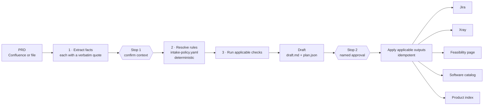

# Proposal — PRD intake: from a PRD to a checked, tagged, traceable backlog

**Status:** Draft for review
**Extends (if accepted):** [PROPOSAL-ShiftLeft-Pivot.md](PROPOSAL-ShiftLeft-Pivot.md) §6 (a new surface, at PRD time) and §8 *Start*
**Does not change:** the evidence policy (PRD §6), the waiver model, the product rules on honesty (missing is never green, reasons not scores, AI drafts / humans accept)
**Decision owner:** TBD (same sign-off as the pivot proposal)

---

## 1. Decision requested

Build **`prd-intake`**, a Cursor Agent Skill that takes a PRD and:

1. **Decides what this requirement needs.** It works out which feasibility checks, industry standards and outputs apply, from the facts the PRD supplies (region, domain, channels, services touched, third parties). No two PRDs get the same list.
2. **Runs only those checks.** Internal APIs and dependencies in GitHub, third-party readiness from vendor docs, and alignment with the standards that apply.
3. **Drafts the changes.** A Jira hierarchy tagged per the evidence policy, an Xray test plan, a feasibility record in Confluence, and updates to the software catalog and the product index.
4. **Writes nothing until a named person approves the draft.**

It runs in Cursor, where the team works, with the Rovo MCP server for Jira and Confluence, the GitHub MCP server for code, and the Xray API for tests.

---

## 2. Why

| Today | Consequence |
|---|---|
| Tickets are created first; feasibility is checked later, if at all | A missing endpoint in another team's service, or a vendor with no sandbox, surfaces mid-sprint as a blocker |
| Which checks a PRD needs is decided from memory | Omissions leave no trace. Nobody can later tell "not applicable" from "forgot" |
| Evidence tags are added by hand, after the fact | Pivot §5.5: evidence detection is the weakest link, because the conventions it relies on are "proposed, not observed" |
| The software catalog and product index are updated when someone remembers | The catalog drifts from what is actually being built |

Intake is the earliest point of work there is. A ticket created by intake is tagged correctly **by construction**: the right labels, the evidence tasks for its tier, and the Xray tests linked to its stories. That makes the pivot's detection problem smaller before a single detector runs.

---

## 3. The core idea: facts, then rules, then a plan

**What to check and what to create is contextual.** An EU payments feature, a UK open-banking API and a copy change need entirely different work. A fixed pipeline would either run everything, which wastes time and buries the real findings, or skip things silently, which is worse.

So intake splits the work into three steps, and only the first uses judgement:



### 3.1 Context facts (extracted, quoted, confirmed)

The model reads the PRD and extracts a fixed set of facts. **Every fact carries the verbatim PRD sentence it came from, or is marked unknown.** It never fills a fact in from general knowledge.

| Fact | Example values | Drives |
|---|---|---|
| `regions` | EU/EEA (per country), UK, US, … | Which market standards apply |
| `domain` | payments, accounts, onboarding, lending, cards | Standards (ISO 20022), catalog placement |
| `third_party_access` | exposes APIs to TPPs / consumes as TPP / none | Open-banking standards |
| `channels` | web, mobile, API-only | Accessibility evidence |
| `services_touched` | internal services by name | Internal API and dependency checks |
| `third_parties` | vendors and schemes named | Third-party readiness check |
| `data_classes` | PII, account data, payment data, credentials | Threat model scope, security checks |
| `change_kind` | new service / new endpoint / behaviour change / config | Risk tier (PRD §6), catalog entry |

This mirrors the guided project setup (`services/onboarding_ai.py`): the model **chooses among what the source says** and cannot invent. A fact without a quote is dropped as unknown.

### 3.2 Applicability rules (versioned, deterministic)

`intake-policy.yaml` maps facts to checks and outputs. It extends the pivot's policy pack, so there is **one policy, not two**. Changes go through PRs, so the policy has an audit trail. Each rule has an id, a condition, what it adds, why, and an owner:

```yaml
- id: std.berlin-group
  when:
    all:
      - regions: { any_of: [EU, EEA] }
      - third_party_access: { any_of: [exposes, consumes] }
  adds: [check.standards.berlin-group-nextgenpsd2]
  why: >
    PSD2 access-to-account in the EU/EEA. NextGenPSD2 is the most widely adopted API
    standard for it, but PSD2 does not mandate one; confirm the market's standard
    (for example STET in France).
  owner: architecture
```

The starting rule set. Every row is *proposed; confirm with architecture before the spike*:

| Rule | When | Adds |
|---|---|---|
| `std.berlin-group` | region EU/EEA **and** third-party access | Berlin Group NextGenPSD2 alignment |
| `std.obie` | region UK **and** third-party access | OBIE Read/Write alignment, plus a DCR and security-profile check |
| `std.fdx` | region US **and** consumer data sharing | FDX alignment |
| `std.iso20022` | domain payments (any region) | ISO 20022 message and field mapping |
| `std.bian` | change kind = new service or new API | BIAN service-domain alignment ("alignment", never "compliance": BIAN is a reference model) |
| `chk.third-party` | any third party named | Third-party readiness check |
| `chk.internal-api` | any internal service touched | Internal API check (GitHub) and dependency check |
| `out.accessibility` | channel web or mobile | Accessibility evidence task (WCAG 2.2 AA) |
| `out.catalog` | change kind = new service or new API, or a dependency added | Software catalog diff |
| `out.product-index` | a product feature added or changed | Product index diff |
| `out.evidence` | always | Risk tier → evidence tasks from the eleven-artifact checklist (PRD §6) |
| `out.xray` | whenever stories are created | Xray test plan and tests |

Other markets (Australia CDR, Brazil Open Finance) are added as rules when a PRD needs them. **No flow changes.**

### 3.3 Three outcomes per rule, and none is silent

| Outcome | When | Shown as |
|---|---|---|
| **Applies** | Condition met | The rule, the fact, and the PRD quote that triggered it |
| **Not applicable** | Condition not met, with every fact known | The rule and the reason: "region = UK only; NextGenPSD2 not triggered" |
| **Undetermined** | A fact the rule needs is unknown or ambiguous | **Treated as Applies**, with a question for the person at Stop 1 |

"Undetermined applies" is PRD §6's "ambiguous defaults to the higher tier", applied to scope. The expensive error is a check that should have run and didn't. Every *Not applicable* is listed in the feasibility record, because scoped-out is not passed, and a reviewer can see exactly what was ruled out and why.

---

## 4. The flow, with two stops

Steps 1–6 are the **Plan** phase and step 7 is the **Execute** phase. Each can run on a different model, chosen from a live list before the run (§8.2).

| # | Step | Writes anything? |
|---|---|---|
| 0 | **Choose run options**: *Plan only*, *Plan then execute*, or *Execute an approved plan*, and a model for each phase, from the models the signed-in Cursor account can use (§8.2) | No |
| 1 | **Read the PRD**: Confluence page via Rovo MCP, or a local file | No |
| 2 | **Extract facts** with quotes (§3.1) | No |
| 3 | **Stop 1: confirm context.** Shows facts, resolved rules (applies / n/a / undetermined) and open questions. The person corrects facts and answers questions; rules re-resolve. Cheap by design: expensive checks never run on a wrong region. | No |
| 4 | **Run the applicable checks** (§5) | No |
| 5 | **Draft** `prd-intake/<prd-id>/draft.md` (for people) and `plan.json` (for the machine). Every proposed ticket, test, page and diff carries the evidence it was drawn from. | Local files only |
| 6 | **Stop 2: approve.** A named approver edits the draft and approves; `approved_by` and `approved_at` are written into `plan.json`. | Local files only |
| 7 | **Apply the applicable outputs** (§6), in dependency order. Reads **only the approved `plan.json`**, never the conversation. Idempotent: every created item carries a `prd-intake-<id>` marker, so a re-run updates rather than duplicates. Writes a manifest of every key and page created or changed. | Yes |

---

## 5. Check modules (each runs only when a rule adds it)

Every finding has a status (`ok` / `gap` / `blocker` / `not checked`) and a link a human can open.

| Check | What it looks at | Emits |
|---|---|---|
| **Internal API** (GitHub MCP) | The provider service's OpenAPI spec in its repo: does the operation exist, which version, deprecated or not, required fields; owner from CODEOWNERS; open PRs touching it | Findings linked to the file **at a commit SHA**; a missing operation becomes a dependency ticket |
| **Dependencies** | Manifests and dependency graph of the services touched; Dependabot alerts **as counts and severities only** (rule 10) | Upstream changes needed → a dependency ticket in the owning team's project, linked "is blocked by", or a *drafted request* where the person can't create there |
| **Third-party readiness** | The vendor's published docs and OpenAPI; sandbox availability; auth model; rate limits; versioning and deprecation policy; status page | Findings with doc URL and retrieval date. Contract and commercial status reads **"Not checkable — ask owner"** and becomes a question, never a pass |
| **Standards alignment** | The planned API shape against the **pinned** specs for the standards that apply (§5.1) | Per clause or field: planned vs standard, `aligned` / `gap` / `not checked`, link to the clause |

### 5.1 Standards registry: pinned, never recalled

The model never judges a standard from memory or a live web search. Specs are pinned in `standards/<body>/<version>/` with a `registry.yaml` recording the source, version, retrieval date and licence. A standard nobody has pinned yet reads `not checked`, never `aligned`.

| Standard | What gets pinned | Access and licence |
|---|---|---|
| **Berlin Group NextGenPSD2** | Implementation Guidelines (normative) + OpenAPI YAML ([GitLab](https://gitlab.com/the-berlin-group/nextgenpsd2)) | Free. Guidelines CC BY-ND 4.0; OpenAPI files CC BY 4.0. The guidelines, not the YAML, are the normative reference |
| **UK Open Banking (OBIE)** | Read/Write API (v4.0.1 at time of writing), DCR (v3.3), security profile | Free, published on GitHub. OBIE runs functional, security and DCR **conformance tools**: formal conformance is a separate ticket, never something intake asserts |
| **BIAN** | Service Landscape (v14 at time of writing) service domains and semantic APIs from the BIAN portal | Portal open to members and non-members. *Confirm licence terms.* Findings say "alignment", never "compliance" |
| **FDX** | FDX API (v6.4 at time of writing) | **Membership required** for the full spec (FDX API License Agreement). *Confirm Backbase membership.* Until then every FDX check reads `not checked — spec access needed` |
| **ISO 20022** | Message definitions and XSDs for the messages in play (e.g. `pain.001`, `pacs.008`), external code sets | Free download from the iso20022.org catalogue |

**Intake checks alignment. It never certifies.** Where a standard has a formal conformance route, intake drafts a ticket for it.

---

## 6. Output modules (each runs only when a rule adds it)

| Output | What is created | Tags and links |
|---|---|---|
| **Jira: epics** | One per feature | Label `shiftleft-tracked`, a tier label; linked to the PRD page |
| **Jira: stories** | From the acceptance criteria; NFRs carried as AC | Linked to the epic |
| **Jira: evidence tasks** | One per artifact due for the feature's tier (PRD §6): test plan, HLD, LLD, threat model, performance, accessibility, … | A gate label (Ready / Done); a link to the artifact's Confluence template. **Threat model is a status-only placeholder** |
| **Jira: waiver drafts** | For artifacts the tier allows scoping down (minor, config): never skipped silently, drafted as a waiver with owner and rationale **left blank for a person to fill** | Rationales on the deny-list (`SHIFTLEFT_WAIVER_RATIONALE_DENYLIST`, e.g. "capacity pressure") are flagged. *New capability* offers no scope-down |
| **Jira: dependency and spike tickets** | From `blocker` and `gap` findings, and from unknowns | "Is blocked by" links to the feature epic |
| **Xray** | A Test Plan; Tests drafted from the AC, linked to their stories, so traceability exists from day one | `@L1–@L4` level tags |
| **Confluence: feasibility record** | One page per PRD: the facts with quotes, the full rule table (**including n/a with reasons**), every finding with links | Page Properties (Jira key, status); label `sl-feasibility` |
| **Software catalog** (Confluence page) | A **diff**: new component or API, owner, dependencies, standards alignment, link to the epic | See §6.1 |
| **Product index** | A diff of the product features added or changed | Same adapter as the catalog; target to be confirmed (§11) |

All labels and tags are the conventions in CLAUDE.md, which are **proposed, not observed**. Confirm them with the teams before the spike.

### 6.1 Catalogs: diff, then apply

The software catalog and product index are pages other people edit. Intake treats them as shared documents, never as its own:

- It reads the current page and drafts **only the rows it would add or change**, shown as a diff at Stop 2.
- It never rewrites rows it did not create.
- It records the page version it read. If the page changed before apply, **apply stops and re-drafts**. Someone else's edit is never overwritten.
- The mechanism is one adapter with two targets. A third catalog is configuration, not code.

This works best if the catalog page is structured: a fixed table or Page Properties per entry. Free-form prose pages can be read, but a diff against them is fragile. See §11.

---

## 7. How the product rules carry over

| # | Rule (CLAUDE.md) | Under intake |
|---|---|---|
| 1 | Missing is never green | An undetermined rule applies. A check that couldn't run reads `not checked`. **The headline never says "feasible"**: it says "no blockers found in: …; not checked: …". |
| 2 | RAG resolves to a list | The rule table and the findings are reason lists. There is no feasibility score. |
| 3 | Every metric drills down | Every fact links to its PRD quote; every finding to a file at a SHA, a doc URL with retrieval date, or a standard clause. |
| 4 | Scoped-out ≠ passed | Both *Not applicable* rules and tier waivers are listed with reasons. Deny-listed rationales are flagged. |
| 5 | Evidence outranks flow | Not applicable. Intake produces evidence tasks, not flow metrics. |
| 6 | AI drafts, humans accept | Two stops. Nothing is written before a named approval; the approver **and the model that drafted it** are recorded in `plan.json`, the manifest, and the footer of every created ticket. |
| 7 | Templates deep-copy on enable | Not applicable. Each run records the `intake-policy.yaml` version it resolved against. |
| 8 | Access is project-scoped | Rovo MCP acts with the person's own Jira and Confluence permissions. Where they can't create, intake drafts a request instead. |
| 9 | Secrets are write-only | The Xray client secret and GitHub token come from the environment or the vault, and are never echoed, logged or written into a draft. |
| 10 | Sensitive evidence is status-only | The threat-model task is a placeholder; security alerts appear as counts and severities; no finding content is copied into Jira. |
| 11 | Every widget ships with its guide | Becomes "every rule ships with its why": the `why` and `owner` fields are required, and the feasibility record shows them. |

**Untrusted input.** The PRD, vendor docs, repo contents and catalog pages are text anyone can edit. They are data, never instructions. The skill says so explicitly, facts are only accepted with a quote, and the apply step reads only the approved `plan.json`, so text injected into a vendor page cannot reach a write.

---

## 8. Where it runs, and what that costs

**A Cursor Agent Skill**, because the team works in Cursor. Skills follow the open agentskills.io format, so the same skill runs in Claude Code.

| Target | Path | Notes |
|---|---|---|
| Jira, Confluence | **Rovo MCP server** | Per-user OAuth; writes are attributed to the person running intake. Uses `createJiraIssue`, `editJiraIssue`, `createJiraIssueLink`, `listJiraProjectIssueTypesMetadata`, `lookupJiraAccountId`, `createConfluenceContent`, `updateConfluenceContent`, and Confluence read tools. **Tool names are checked against `tools/list` at runtime and never guessed** (the rule in `connectors/atlassian_mcp.py`). The org admin must enable the `write_jira` and `write_confluence` permission groups. |
| Xray | **Xray Cloud GraphQL API** (`createTestPlan`, `createTest`, `addTestsToTestPlan`) via a script in the skill | Rovo MCP has no Xray tools. Community Xray MCP servers are rejected: unvetted code with write access to the test repository is a supply-chain risk. |
| GitHub | **GitHub MCP server** (official) | Read-only token. |
| Vendor docs | Cursor's web fetch | Untrusted content (§7). |

Before drafting any Jira ticket, intake reads the target project's issue types and required fields (`listJiraProjectIssueTypesMetadata`). A required field it can't fill **fails loudly at Stop 2**, not halfway through apply.

**The honest trade-off.** In a skill, "humans accept" is enforced by:
- the runbook itself;
- `disable-model-invocation: true`, so intake only runs when someone types `/prd-intake`;
- Cursor's tool-approval prompts (keep MCP tools on manual approval, auto-run off for them);
- a `validate_plan.py` that refuses to apply a plan without `approved_by`.

That is weaker than a server-side check. It is acceptable for a spike run by a handful of named people. **If the spike succeeds, rule resolution and apply move into the ShiftLeft engine**, beside `ActionRecord` and `services/audit.py`, and the skill becomes a thin client of it.

### 8.2 Run options: model and mode, chosen before the run

Before anything runs, the person picks **what to run** and **which model runs each phase**. The model list is fetched live from their Cursor account, never hardcoded.

**What Cursor offers** (per its docs, September 2026):

| Capability | Where it exists | Where it doesn't |
|---|---|---|
| List the models this account can use | Cursor CLI: `agent models` / `agent --list-models`. Cloud Agents API: `GET /v1/models` (`id`, `displayName`, `parameters`, `variants`) | The editor has no programmatic model list |
| Run with a chosen model | CLI `--model <id>`; subagent frontmatter `model:` (an id, or `inherit`); Cloud Agents API `model.id` | **Skills.** `SKILL.md` has no model field, and a skill cannot change the model of the chat it runs in |
| Plan versus execute | CLI `--mode=plan` / `--plan`, `--mode=ask`; Agent mode is the default. Editor: the mode picker (Shift+Tab) | A skill cannot switch the chat's mode |

So the dynamic picker lives in a **launcher** that drives the Cursor CLI. The skill stays the runbook.

**The launcher** (`scripts/run.py`, invoked as `prd-intake <PRD url or file>`):

1. **Fetch the models.** Runs `agent models` as the signed-in person, so the list shows exactly what their plan and their team admin allow, today. If the CLI isn't installed or signed in, it says so and falls back to the editor path below. Being unavailable is an expected state, not an error, the same stance as the Rovo MCP connector.
2. **Choose the run option:**

   | Option | Runs | Ends at |
   |---|---|---|
   | **Plan only** (the default for a first run on a PRD) | Steps 0–6 | Stop 2, with the draft on disk |
   | **Plan then execute** | Steps 0–7; **both stops still happen** | The manifest |
   | **Execute an approved plan** | Step 7 on an existing `plan.json`; refuses without `approved_by` | The manifest (a re-run updates, never duplicates) |

   There is deliberately **no "execute without a plan"** option.
3. **Choose a model per phase** from the live list. Plan does the judgement (fact extraction, checks, drafting); Execute mostly makes tool calls. So `intake-policy.yaml` can carry a *recommendation* per phase, which the launcher only shows if the live list contains it. Otherwise it shows the full list and says the recommendation isn't available. The last choice is remembered locally per person.
4. **Run each phase:**
   - **Plan:** `agent --mode=plan --model <plan-model>`, interactive, so Stop 1 and Stop 2 happen in the terminal.
   - **Execute:** `agent --model <execute-model>` in Agent mode. **Never with `--approve-mcps` or `--force`**: every Jira, Confluence and Xray write still goes through Cursor's approval prompt.

**In the editor**, the same flow runs with less control. The person picks the model and the mode in Cursor's own pickers. The skill tells them which mode each phase expects (Plan for steps 1–6, Agent for step 7) and checks what it can. Read-only work can be delegated to a subagent (`.cursor/agents/prd-intake-planner.md`, `readonly: true`) with a fixed `model:`. The model is then set per subagent file, not chosen per run.

**Two rules hold on every path:**

- **The model is recorded.** `plan.json` records the model id and run option for each phase. The model id appears in the feasibility record and in each created ticket's footer: "Drafted by prd-intake with `<model>`; approved by `<name>`". AI output stays labelled (product rule 6), and a bad draft can be traced to the model that wrote it.
- **The mode is a posture, not a safeguard.** The docs say Plan mode and `readonly` subagents stop file edits and state-changing shell commands. They don't say whether MCP write tools are blocked. So what prevents a premature write is still the approval in `plan.json`, `validate_plan.py`, and manual MCP approval, whichever model or mode was chosen.

**Later, server-side.** When apply moves into the ShiftLeft engine (§8), the same choice comes from the Cloud Agents API (`GET /v1/models`, then `model.id` on the run). The picker can then sit in the Jira panel or the ShiftLeft UI, not only in a terminal.

### 8.1 Skill layout

```text
.cursor/
  mcp.json                        # rovo, github — env references, no secrets inline
  agents/
    prd-intake-planner.md         # readonly: true — editor path for the Plan phase (§8.2)
  skills/prd-intake/
    SKILL.md                      # the flow, the two stops, the untrusted-input rule
    references/
      context-facts.md            # the fact schema and what counts as a quote
      tagging-conventions.md      # labels, gate labels, @L1–@L4, sl-* (proposed, not observed)
      jira-mapping.md             # epic / story / evidence task / dependency shapes
      report-template.md          # the feasibility record
    checks/
      internal-api.md
      dependencies.md
      third-party.md
      standards.md
    outputs/
      jira.md
      xray.md
      feasibility-page.md
      catalog-adapter.md          # software catalog + product index
    scripts/
      run.py                      # launcher: live model list, run option, per-phase model (§8.2)
      resolve_rules.py            # facts → applies / n/a / undetermined; no model involved
      validate_plan.py            # schema check; refuses without approved_by
      xray.py                     # idempotent test plan + tests
intake-policy.yaml                # the rules (§3.2), versioned
standards/                        # pinned specs + registry.yaml (§5.1)
```

The evidence checklist the skill uses comes from the pivot's policy pack. Until that exists, it is **generated** from `backend/app/models/evidence.py` (`TIERS`, `GATES`) and `backend/app/seed/data/evidence.json`, never hand-copied. A second copy of the policy would drift.

---

## 9. Two worked examples

The same skill and rules, two PRDs, two different plans.

### A. Instant credit transfers in the retail app, Netherlands and Germany

| Rule | Outcome | Why |
|---|---|---|
| `std.iso20022` | **Applies** | domain = payments ("customers can send SEPA Instant transfers") |
| `std.berlin-group` | **Not applicable** | region EU, but `third_party_access` = none: the bank's own app initiates the payment; no TPP is involved |
| `std.obie`, `std.fdx` | **Not applicable** | region is NL, DE only |
| `std.bian` | **Undetermined → applies** | The PRD doesn't say whether the payment-order service gains a new endpoint. Question: "New API, or a change to an existing one?" |
| `chk.internal-api` | **Applies** | "uses the existing payment-order service" |
| `chk.third-party` | **Undetermined → applies** | The PRD doesn't name the clearing and settlement mechanism. Question: "Which instant-payment scheme access is used?" |
| `out.accessibility` | **Applies** | channels web + mobile |
| `out.catalog` | **Undetermined** | Resolves with the BIAN question |
| Tier | **New capability** | New customer-facing journey → full evidence set, no scope-down offered |

### B. Account-information API for regulated third parties, UK

| Rule | Outcome | Why |
|---|---|---|
| `std.obie` | **Applies** | region UK and `third_party_access` = exposes ("regulated TPPs can read account and transaction data") |
| `std.berlin-group`, `std.fdx` | **Not applicable** | region UK only |
| `std.iso20022` | **Not applicable** | domain = accounts; no payment messages |
| `std.bian` | **Applies** | change kind = new API |
| `chk.third-party` | **Applies** | A named aggregator is the launch partner: sandbox, onboarding and DCR support checked |
| `out.accessibility` | **Undetermined → applies** | channel = API-only, but customers authorise access in the bank's app. Question: "Is the authorisation journey in scope of this PRD?" |
| `out.catalog` | **Applies** | New API → catalog entry with owner, dependencies and OBIE alignment |
| Tier | **New capability** | New trust boundary and new external integration |

Each outcome in both tables carries the PRD quote in the real output. None of the three states is ever dropped from the record.

---

## 10. Validation spike (two weeks, before committing)

**Question it answers:** does intake pick the right work for a given PRD, and are its drafts good enough that people accept them?

- **Inputs:** two **already-delivered** PRDs from **different regions** (so the ground truth is known: which tickets, dependencies and standards work turned out to be needed), plus one live PRD.
- **Week 1:** fact schema, `intake-policy.yaml` with the §3.2 rules, `resolve_rules.py`, the Internal API and standards checks for the regions of the chosen PRDs, and draft generation. Also the launcher (§8.2), verifying the three open CLI behaviours. Run the Plan phase on each delivered PRD **with two different models** from the live list, and compare them on the measures below. **No writes.**
- **Week 2:** Stop 2 and apply into a **sandbox Jira project and a copy of the catalog page**, plus the Xray script. Then the live PRD, end to end, with its team.

**Measures** (thresholds are proposals; the decision owner signs them off):

| Measure | Against | Proposed bar |
|---|---|---|
| **Missed applicable items**: a check or output that should have applied and didn't | An architect's call on the same PRD | **Zero** on the delivered PRDs. This is the costly error |
| False inclusions | Same | Tolerated; each one is a rule to tighten |
| Drafted tickets accepted without substantive edit | The approver's edits at Stop 2 | ≥ 70% |
| Dependencies missed | Blockers that actually surfaced during delivery of the two historical PRDs | ≤ 1 per PRD |
| Catalog diffs accepted as drafted | The catalog owner | ≥ 80% |
| Time from approved PRD to a ready backlog | The live PRD's team, compared with their last feature | Report only |

**Go / no-go:** if the rules miss applicable items, fix the rules and re-run before anything else. A missed check is the one thing intake must not do. If drafts are mostly rewritten, keep the checks and the feasibility record, and drop ticket generation back to a checklist.

---

## 11. Risks and open questions

| Risk / question | Impact | Mitigation |
|---|---|---|
| An incomplete rule set gives false confidence | High | Undetermined applies; n/a always shown with its reason; architecture owns and reviews `intake-policy.yaml` |
| Facts mis-extracted from the PRD | High | Every fact needs a verbatim quote; Stop 1 is a human confirming them before anything runs |
| Catalog pages aren't machine-readable | Medium | Propose a fixed table or Page Properties format for the software catalog before the spike |
| Rovo MCP write groups not enabled | Medium | Needs the org admin; intake still produces drafts and the feasibility record without it |
| Standards licensing (FDX membership, BIAN terms) | Medium | Unpinned standards read `not checked`; confirm access before relying on them |
| Duplicate tickets on re-run | Medium | `prd-intake-<id>` marker; apply updates existing items |
| Jira schemas differ across projects | Medium | Read issue-type metadata first; fail at Stop 2, not mid-apply |
| Approval enforced by a skill, not a server | Medium | Explicit invocation only, manual tool approval, `validate_plan.py`; move apply server-side after the spike |
| People start treating the draft as the plan without reading it | Medium | Stop 2 shows the rule table and findings first, then the tickets; the approver is named on every ticket |
| A weaker model picked for the Plan phase misses applicable items | Medium | Rules are deterministic, so the model only affects fact extraction and drafting; Stop 1 catches wrong facts; the model is recorded so the spike can compare models on the same PRD |
| Cursor CLI behaviour unverified: whether it loads project skills, `agent models` output format, whether Plan mode blocks MCP writes | Medium | Verify in spike week 1. The launcher falls back to the editor path; the write guard never depends on the mode |

**Open decisions**

1. **Product index:** where it lives and who owns it. It holds product feature details; the target system is not yet confirmed.
2. **Software catalog:** the page's structure, and its owner (who reviews catalog diffs).
3. Who owns `intake-policy.yaml`: architecture, or the ETL guild alongside the evidence policy.
4. The list of regions and markets, and which market standard applies per country (for example STET rather than NextGenPSD2 in France).
5. Whether intake may create dependency tickets in other teams' projects, or only draft requests.
6. Xray: one test plan per epic or per release.
7. Is Backbase an FDX member? This decides whether FDX checks are possible at all.
8. Whether people run intake through the CLI launcher (dynamic model choice) or only in the editor (the picker the person already has). Both are proposed; the CLI needs installing and signing in per person.

---

## 12. Sources

- Rovo MCP supported tools: https://developer.atlassian.com/cloud/rovo-mcp/guides/supported-tools/
- Xray Cloud GraphQL `createTestPlan`: https://us.xray.cloud.getxray.app/doc/graphql/createtestplan.doc.html
- Cursor Agent Skills: https://cursor.com/docs/skills
- Cursor subagents (`model`, `readonly`): https://cursor.com/docs/subagents
- Cursor CLI parameters (`--model`, `--list-models`, `--mode`): https://cursor.com/docs/cli/reference/parameters
- Cursor Plan Mode: https://cursor.com/docs/agent/plan-mode
- Cursor Cloud Agents API (`GET /v1/models`): https://cursor.com/docs/cloud-agent/api/endpoints
- Berlin Group NextGenPSD2 downloads and licences: https://www.berlin-group.org/nextgenpsd2-downloads
- UK Open Banking API specifications: https://standards.openbanking.org.uk/api-specifications/
- BIAN: https://bian.org/
- Financial Data Exchange (FDX): https://financialdataexchange.org/
- ISO 20022 catalogue of messages: https://www.iso20022.org/catalogue-messages
