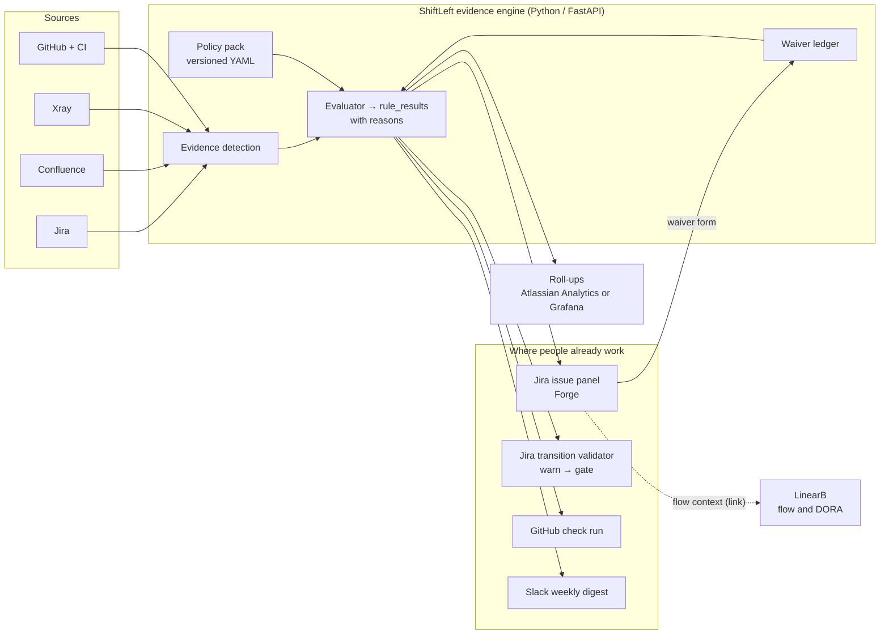

# Proposal — Re-shape ShiftLeft from a reporting platform into an evidence engine surfaced where work happens

**Status:** Draft for review
**Amends (if accepted):** PRD §3, §5, §7, §8, §12 · TDD §2, §4, §5, §6, §10
**Does not change:** the evidence policy (PRD §6), the waiver model, the product rules on honesty (missing is never green, reasons not scores, AI drafts / humans accept)
**Decision owner:** TBD (same sign-off as the PRD)

---

## 1. Decision requested

Stop building ShiftLeft as a standalone observability platform: six perspectives, a dashboard builder, template governance, its own connectors, its own access control. Instead, build it as an **evidence policy engine** whose results appear **inside the tools engineers already use**: Jira, GitHub, Slack and Confluence. Existing tools cover reporting, and we build the one roll-up nobody sells.

The evidence policy stays unchanged. Where it appears and how much we build around it are what change.

---

## 2. Why now

The PRD already names the risks that this proposal addresses. The current plan manages them; this proposal removes them by design.

| Signal | Where it's written | What it tells us |
|---|---|---|
| "Reporting without behaviour change" | PRD §13, TDD §13 | A dashboard people must remember to open only changes behaviour when a review meeting forces it. |
| Connector fragility — **High** | TDD §13 | A 16-connector (35+ target) integration layer becomes the team's main job. |
| "In practice flow ships first because it's easier" | PRD §12 | This happened. Team Insights (flow) was the first build item. |
| "Not a new approval gate" | PRD §3 | The platform is barred from the one move that actually shifts left. |

**The sunk cost is low.** The reusable part (the evidence rule engine, waiver model, freshness guard and period logic) carries over as is. The parts this proposal drops (dashboard builder, template deep-copy, connector config UI, grants UI) are early. The only live connector is `atlassian_mcp.py`, which is used for discovery; the rest is `mock.py`. Evidence statuses currently come from seed data, which means **evidence detection, the hardest and most valuable problem, has not been built under either plan.**

---

## 3. Reporting on shift-left isn't shifting left

Shift-left moves quality work earlier, **to the moment it's done**: when a ticket moves to *Ready*, when a PR is opened, when a design is reviewed. Signals only change behaviour when they reach people at those moments.

The current plan puts evidence status on a separate site at `shiftleft.backbase.com`, looked at later, usually in a review. It will say accurately that a feature started without a test plan, but only after the feature has started. That's valuable for audit and useless for prevention.

The proposal keeps the audit value and adds prevention: the same "why red" list appears on the Jira issue when someone tries to move it, and on the PR when someone opens it.

---

## 4. Build versus already owned

Most of the platform duplicates tools Backbase either has or can license. Rows marked *confirm* depend on current licences.

| Planned piece | Existing equivalent | Fit | Status |
|---|---|---|---|
| Team Insights: cycle time, throughput, PR size, DORA | **LinearB** (already listed as a connector); Swarmia / DX / Jellyfish | Full | *confirm LinearB scope* |
| Traceability matrix, test evidence per requirement | Xray Requirement Traceability Report, Test Coverage Report, per-issue requirement status | Full | In use |
| Per-feature document checklist | Confluence templates + Page Properties + Page Properties Report, labels | Partial: presence yes, policy no | Available |
| Enforcing Ready / Done | Jira workflow validators and conditions; Automation for Jira | Mechanism yes, policy no | Available |
| "Is it ready?" scorecards | **Atlassian Compass** scorecards (criteria, JQL metrics, custom fields) | **Poor for this purpose.** Scores are weighted percentages per *component/service*, not per feature, and a score is exactly what PRD §4.4 rules out. Good for service hygiene, not feature evidence. | *confirm licence* |
| Portfolio / executive roll-ups | **Atlassian Analytics + Data Lake** (SQL over Jira/Confluence/JSM, can join external data) | Good | **Cloud Enterprise only.** *Confirm plan.* Otherwise Grafana/Metabase over our tables. |
| Project-scoped access control | Jira project permissions, inherited automatically by a Forge app | Full for Jira surfaces | Available (Cloud) |
| Guided setup / lookup | Rovo / Rovo MCP (already used in onboarding) | Full | In use |

**Verdict.** Flow metrics, traceability, document presence, roll-up rendering and access control are all solved problems. Nothing on the market implements **our evidence policy**.

---

## 5. What stays custom (the product)

This is roughly a fifth of the current plan, and the only part nobody sells:

1. **The evidence policy.** The eleven-artifact DoR/DoD checklist, gates, accountable roles (PRD §6).
2. **Risk-tier scoping.** New capability / major / minor / config, with "ambiguous defaults to the higher tier".
3. **The waiver ledger.** Artifact, tier, owner, rationale, timestamp; deny-listed rationales ("capacity pressure") flagged as a planning signal.
4. **Why-red as a reason list.** Never a score.
5. **Evidence detection.** Deciding, from Jira + Confluence + Xray + CI (+ Figma), whether each artifact is present, drafted, stale or missing, without people tagging it by hand. Today this relies on source tagging that CLAUDE.md calls "proposed, not observed". It's the weakest link and the core of the product.

---

## 6. Proposed architecture

**Components**

| Component | What it is | Reuses |
|---|---|---|
| Policy pack | Checklist, tiers, gates, thresholds, deny-list as versioned YAML in git. Changes go through PRs, so the policy has an audit trail for free. | Constants now in `services/readiness.py` (`DENIED_RATIONALES`, `RELEASE_BAR`, `STATUS_RAG`), `models/evidence.py` (`TIERS`, `GATES`) |
| Evidence detection | Per-artifact detectors over Jira REST, Confluence REST, Xray API, GitHub/CI. Sync is event-driven via webhooks where available, with a scheduled backstop. | Connector contract (`connectors/base.py`), `NormalizedArtifact` |
| Evaluator | Produces `rule_results` with a literal reason list per feature and gate. Freshness guard downgrades stale sources. | `services/readiness.py`, `services/freshness.py` (`guard`), `schemas/common.RagState` |
| Waiver ledger | Structured waivers with deny-list flagging, and AI drafts that need recorded acceptance. | `ArtifactWaiver`, `ActionRecord`, `services/audit.py` |
| **Jira issue panel** (Forge `jira:issuePanel`) | On every Epic/Feature: the evidence checklist, why-red list, drill-down links, and the waiver form. Calls the engine via Forge Remote. | Port of `evidence-panel.ts` content |
| **Transition validator** (Forge `jira:workflowValidator`) | On *Ready for Dev* and *Done*: blocks the transition, or warns, until evidence is present or waived, depending on the gating stage (§9). | Evaluator output |
| **GitHub check run** | On PRs: the linked Jira key exists, has AC and a test plan, and the required test tags are present. Neutral while in warn mode, failing when gated. | Evaluator output |
| **Slack digest** | Weekly per team: red features, their reasons, owners, next actions. Implements PRD §9 without a new UI. | `ActionRecord` |
| **Confluence templates** | HLD / LLD / test plan / threat-model templates with Page Properties carrying the Jira key and status, so evidence is **detectable by construction**. | Guides' "how to tag it at source" field |
| Roll-ups | SQL views over `rule_results` and `artifact_waivers`, rendered in Atlassian Analytics (if on Enterprise) or Grafana/Metabase. Portfolio and executive views become queries, not screens. | Tables already modelled |

Forge notes (verified against Atlassian docs, September 2026): `jira:workflowValidator` is a *preview* module (documented as stable but still evolving), works in company- and team-managed projects, and can run a Forge function rather than only a Jira expression, so it can consult the engine. The issue panel can call an external backend through Forge Remote. Forge is Cloud-only, which fits Backbase's Cloud deployment.

---

## 7. How the product rules carry over

| # | Rule (CLAUDE.md) | Under this proposal |
|---|---|---|
| 1 | Missing is never green | **Kept.** Freshness guard unchanged. The Jira panel and PR check show `Missing` / `Stale` explicitly. |
| 2 | RAG resolves to a list | **Kept, more visible.** The reason list is the validator's error message and the PR check's summary. |
| 3 | Every metric drills down | **Kept.** Each reason links to the Jira issue, Confluence page, Xray execution, PR or CI run. |
| 4 | Scoped-out ≠ passed | **Kept.** Waivers are captured in the Jira panel with owner and rationale; the deny-list is flagged. |
| 5 | Evidence outranks flow | **Kept, simpler.** We no longer host flow screens, so there's nothing to banner. LinearB links back to the Jira evidence panel. |
| 6 | AI drafts, humans accept | **Kept.** AI drafts appear in the panel as labelled suggestions; acceptance is recorded against the Jira user. |
| 7 | Templates deep-copy on enable | **Retired.** No dashboard templates. The policy pack is versioned in git, and each evaluation records the policy version it used. |
| 8 | Access is project-scoped | **Changed mechanism, same rule.** Jira surfaces inherit Jira project permissions. The engine's own API keeps project-scoped authz for roll-ups, and the authz test suite stays. |
| 9 | Secrets are write-only | **Kept.** Fewer secrets overall: Forge handles Atlassian auth. |
| 10 | Sensitive evidence is status-only | **Kept.** Threat-model and security-finding presence and status only. |
| 11 | Every widget ships with its guide | **Becomes "every check ships with its guide".** The four fields attach to each policy rule and render in the panel. |

---

## 8. Stop · keep · start

| Stop | Keep | Start |
|---|---|---|
| Dashboard builder, per-widget query binding + preview | Evidence rule engine (`services/readiness.py`) | Policy pack (YAML) + loader |
| Template catalogue and deep-copy governance | Evidence models: `ArtifactDefinition`, `FeatureEvidence`, `ArtifactWaiver`, `ActionRecord` | **Evidence detection**: real Jira / Confluence / Xray / GitHub readers |
| Connector config UI for 16 connector types | Freshness guard (`services/freshness.py`) | Forge app: issue panel + transition validator |
| Access & SSO grants UI | Reporting windows (`services/periods.py`), for roll-ups | GitHub check run |
| Team Insights as a bespoke screen (use LinearB) | Audit log, authz test suite | Slack digest |
| Four of the six perspectives as bespoke screens | Rovo MCP discovery (`connectors/atlassian_mcp.py`) | Confluence evidence templates |
| | Feature Readiness page: kept as an internal/admin view while the Jira panel replaces it for everyday use | Roll-up SQL views |

---

## 9. Gating path: warn, then gate

The PRD's "not a gate" stance is open for debate. We propose earning the gate rather than imposing it.

| Stage | Behaviour | Moves on when |
|---|---|---|
| **0 · Observe** | Engine evaluates; results visible only in the panel. No messages, no blocks. | Detection accuracy ≥ 90% against a manual audit of the pilot features (§10). |
| **1 · Warn** | Validator and PR check *warn* and never block. Slack digest starts. | Two sprints with a false-red rate under 5%, and the team agrees the reasons are fair. |
| **2 · Soft gate** | Transition blocked unless evidence is present **or a waiver is recorded in the panel**. Recording a waiver takes seconds, but it's attributed and reportable. | One release cycle; waiver volume and deny-listed rationales reviewed with ETLs. |
| **3 · Hard gate (by tier)** | *New capability* and *major change*: no waiver path for mandatory artifacts (PRD §6: "no scoping down offered"). Minor and config changes stay soft. | Engineering leadership decision per tier. |

Every stage can be rolled back per project with a config flag.

---

## 10. Validation spike (two weeks, before committing)

**Question it answers:** can we detect evidence reliably enough to show it on a Jira issue without embarrassing ourselves?

- **Scope:** one team, around 10 live features spanning at least two risk tiers.
- **Week 1:** build detectors for Jira (AC, linked tests), Confluence (HLD/LLD/test plan by link or page property), Xray (traceability, executions) and CI (test results). Run them against the 10 features.
- **Measure:** for each artifact, detected status versus a manual audit by the team's ETL. **The headline metric is the share of artifacts detected correctly without manual tagging.**
- **Week 2:** a minimal Forge issue panel for that team (read-only, Stage 0) plus one Slack digest.
- **Go / no-go:** detection ≥ 90% → proceed to Stage 1. 70–90% → roll out Confluence templates first, then re-measure. Below 70% → evidence lives in too many unstructured places; fix source conventions before building anything else.

After the spike, run Stage 1 for 2–3 sprints and track PRD §11's behaviour metrics: DoR completeness before dev starts, DoD completeness at sign-off, and the share of omissions with a defensible rationale.

---

## 11. Risks and open questions

| Risk / question | Impact | Mitigation |
|---|---|---|
| Evidence detection accuracy | High: a wrong red in someone's Jira is worse than no signal | The spike measures it before any rollout. Stage 0 is invisible. |
| Forge validator module is in preview | Medium | Stages 0–1 don't depend on it (panel + warnings only). Re-check status before Stage 2. |
| Stakeholder buy-in on gating | High | Staged path with explicit exit criteria. Waivers keep a human override at every stage but 3. |
| Licence coverage (LinearB scope, Atlassian Enterprise for Analytics, Compass) | Medium | Inventory before the spike ends. Grafana/Metabase is the fallback for roll-ups. |
| Engineers experience it as bureaucracy | Medium | Warn mode first; the panel's reasons each come with a one-click fix path (link to template, link to Xray). |
| Stack: Python engine + Forge (Node) app | Low | Forge app stays thin (UI + Remote calls); logic stays in the Python engine. |
| Jira workflows vary per project | Medium | Validator is added per workflow by project admins; the panel works everywhere regardless. |

**Open decisions**

1. Accept the pivot (§1), or keep the platform and only trim scope?
2. Is Backbase on Atlassian Cloud **Enterprise** (Analytics + Data Lake) or Premium?
3. Pilot team for the spike, and its ETL for the manual audit.
4. Who owns the policy pack: the ETL guild or the platform team?
5. Keep the Feature Readiness page as an admin view, or retire it once the panel ships?

---

## 12. Tracked in the app: the Shift-left Rollout board

The rollout this proposal describes is tracked on its own board, next to Feature Readiness under **Evidence**. The existing boards (Feature Readiness, Team Insights, Settings) are unchanged.

| Board element | Proposal section | Where it lives |
|---|---|---|
| Gating path: four stages, exit criteria for the current one, sign-off / advance / roll back | §9 | `backend/app/services/rollout_rules.py` (thresholds as named constants), `backend/app/api/routes/rollout.py` |
| Tiles: detection accuracy, false-red rate, warnings resolved with evidence, readiness for the next stage | §10, PRD §11 | `backend/app/services/rollout.py` |
| Surfaces: Jira panel, transition check, PR check, Slack digest, Confluence templates | §6 | `rollout_surfaces` table |
| Detection by artifact: engine against the ETL's manual audit | §5.5, §10 | `detection_audits` table |
| Accuracy and warning-outcome charts by sprint | §10 | `rollout_sprints` table |

Rules the board enforces, each covered in `backend/tests/test_rollout.py`:

- A stage is advanced only when every exit criterion is met. A refusal returns the unmet criteria as a list. Advancing is admin-only; sign-off needs a contributor; a rollback is always allowed for an admin but must give a reason. All three are audited.
- Unmeasured is `Missing`, never green: no audit, or no warnings before Warn. Charts don't draw zeros for sprints that weren't measured.
- A surface that is correctly off reads "Not due yet" (neutral), not healthy. A gating surface blocking ahead of its stage is red.
- Freshness is guarded per widget: a detector reading a stale Xray can't read green, while a PR check reading GitHub isn't held back by Xray.
- Unenrolled projects return a 404 that calls this a gap.

The fixture data is in `backend/app/seed/data/rollout.json`. Entitlements is the pilot at Warn, Payments is at Observe, and Nucleus has enrolled but has nothing measured yet. Stores seeded before the board existed are backfilled on boot.

---

## 13. Sources

- Forge Jira workflow validator: https://developer.atlassian.com/platform/forge/manifest-reference/modules/jira-workflow-validator/
- Forge Jira issue panel: https://developer.atlassian.com/platform/forge/manifest-reference/modules/jira-issue-panel/
- Forge Remote from a frontend: https://developer.atlassian.com/platform/forge/remote/calling-from-frontend/
- Compass scorecards: https://support.atlassian.com/compass/docs/what-are-scorecards/
- Atlassian Analytics GA for Cloud Enterprise: https://community.atlassian.com/forums/Atlassian-Analytics-articles/Atlassian-Analytics-is-generally-available-for-Cloud-Enterprise/ba-p/2346561
- Xray Test Coverage Report: https://getxraydocs.atlassian.net/wiki/spaces/XRAYCLOUD/pages/44565216
- Xray Requirement Traceability Report: https://docs.getxray.app/display/XRAY/Requirement+Traceability+Report
